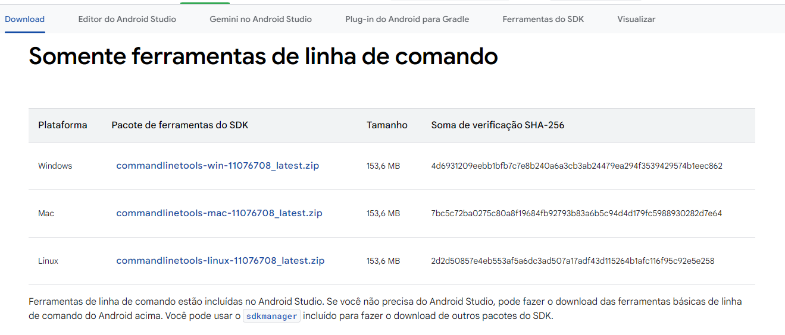
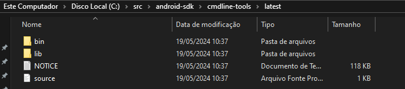

Baixar o SDKCommandLine-tools - Android SDK
https://developer.android.com/studio?hl=pt-br

Crie uma Pasta src na Raiz C:
crie uma Pasta android-sdk
C:\src\android-sdk
descopacte o SDKCommnadLineTools 
C:\src\android-sdk\cmdline-tools
Crie a pasta latest e cloque todos os arquivos nessa pasta 
C:\src\android-sdk\cmdline-tools\latest

